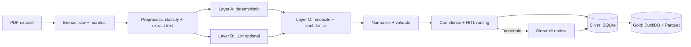

# PropIntelli AI

**Document Intelligence & Data Extraction Platform**: turns unstructured German
real-estate exposés (Immobilien-Exposés) into validated, structured property data.

> This is not a PDF parser. It is a medallion-architecture document-intelligence
> platform with hybrid (deterministic + LLM) extraction, confidence-driven
> human-in-the-loop review, a systematic evaluation harness, structured error
> handling, and enterprise integration (C# microservice, Docker, CI/CD, Azure
> mapping).

Built as a take-home case study for a Senior Data & AI Consultant role
(Microsoft Data & AI). Use case: extract **Fläche, Preis, Lage, Ausstattung,
Baujahr** (and more) from PDF exposés.

## Highlights

- **Hybrid extraction**: a layout-agnostic deterministic baseline (regex/heuristics,
  always on, offline) with German **negation handling** (tri-state booleans:
  present / explicitly-absent / not-stated) and ancillary-cost–aware price
  selection, plus an **optional, pluggable LLM layer** (`none` / Ollama / OpenAI /
  Azure OpenAI) reconciled per field with confidence scoring.
- **Medallion architecture**: Bronze (raw + manifest) → Silver (validated records,
  SQLite/SQLAlchemy) → Gold (DuckDB + Parquet/CSV analytics).
- **Confidence-driven HITL**: auto-approve / review / manual routing; a Streamlit
  app to correct flagged fields, feed corrections back, and publish the Gold
  analytics layer from Silver on demand (the full Bronze → Silver → Gold flow).
  The app shows the active extraction backend, the per-field source breakdown,
  and the reconciliation notes, so the hybrid (deterministic + LLM) decisions are
  visible during a demo, plus corpus-analytics charts (review-status distribution
  and, for sale listings, price vs. living area) over the stored Silver records,
  and the Gold market summary as an average-€/m²-by-city bar chart.
- **Two-corpus evaluation**: a synthetic corpus measures **consistency** (0.996
  macro-F1) and an independently-authored **holdout** measures **generalization**
  (0.896 macro-F1); all metrics carry **95% Wilson confidence intervals**, and
  per-field confidence is **calibrated and measured** (Brier 0.038), not asserted.
- **Data quality**: mandatory/range/plausibility rules (incl. €/m² by listing type).
- **Meaningful errors**: structured `ProcessingError` with developer + user messages;
  failures are classification signals, never silent crashes.
- **Enterprise extras**: C# .NET 8 ingestion/validation microservice (PDF-validated,
  size-capped) wired to extraction via a Bronze watcher, Docker Compose, GitHub
  Actions CI, full Azure production mapping.
- **Strict quality gates**: `ruff format` + lint, `mypy --strict`, NumPy docstrings,
  pytest with an 80% coverage floor.

## Architecture at a glance



Full diagrams, decisions/trade-offs, and the Azure mapping: [`docs/architecture.md`](docs/architecture.md).

## Quickstart

Requires Python 3.11+ and [uv](https://docs.astral.sh/uv/).

```bash
uv sync --all-extras                       # create the venv + install everything

uv run propintelli generate-samples        # 13 synthetic exposés + ground truth
uv run propintelli batch sample_data/raw   # process them into the Silver store
uv run propintelli evaluate                # consistency: per-field accuracy + CIs + calibration
uv run propintelli export                  # publish the Gold analytics layer
uv run propintelli run sample_data/raw/expose_01_nuernberg_eigentumswohnung.pdf

uv run propintelli generate-holdout        # authored, hand-labelled generalization set
uv run propintelli evaluate \              # generalization: lower, honest, with CIs
  --raw-dir sample_data/holdout/raw --truth-dir sample_data/holdout/ground_truth

uv run streamlit run app/streamlit_app.py  # human-in-the-loop demo UI
```

The UI's corpus-analytics charts read the Silver store, so running `batch` (above)
first populates them; a fresh store simply shows no charts until records exist.

Quality gate (what CI enforces):

```bash
make check        # ruff format --check + ruff check + mypy --strict + pytest --cov
```

### Enabling the optional LLM layer

The pipeline is offline by default. To add the LLM second opinion, set in `.env`
(see [`.env.example`](.env.example)):

```bash
PROPINTELLI_LLM_PROVIDER=ollama        # or openai / azure_openai
PROPINTELLI_LLM_PROMPT_VARIANT=v2_schema
```

Setting this in `.env` enables the LLM for every local entry point (the UI,
`batch`, `run`, `watch`). The test suite and `propintelli evaluate` stay
deterministic regardless, the suite pins the provider to `none` and `evaluate`
defaults to it, so CI and the reported accuracy numbers are unaffected by a
local `.env`.

With a backend set, compare the three prompt variants on a corpus:

```bash
uv run propintelli compare-prompts \
  --raw-dir sample_data/holdout/raw --truth-dir sample_data/holdout/ground_truth
```

To demo the hybrid layer **live in the UI** with a local Ollama model (requires
`ollama serve` and a pulled model, e.g. `llama3.1`):

```bash
make ui-llm   # launches Streamlit with PROPINTELLI_LLM_PROVIDER=ollama and a raised timeout
```

The app shows the active extraction backend, a per-field **source breakdown**
(deterministic / llm / reconciled / manual), and a **reconciliation-notes** panel
that surfaces where the two layers disagreed. Local 8B inference is slow
(~130–500 s/document on CPU), which is why the timeout is raised and the default
demo (`make ui`) stays deterministic and instant; in production this slot is an
Azure OpenAI deployment with sub-second latency.

### Full stack with Docker

```bash
docker compose up --build   # C# API (:8080) + Streamlit UI (:8501) + Bronze worker
```

The worker seeds the bundled samples, then **watches the shared Bronze store** and
extracts anything the C# API ingests, so `POST /api/documents/upload` flows
through to the Silver store without manual steps.

## Results

Two corpora answer two different questions (full tables, CIs, and the calibration
reliability table: [`docs/evaluation.md`](docs/evaluation.md)). Deterministic
baseline, fully offline:

| Corpus | What it measures | Field accuracy | Macro F1 | Exact-match |
| --- | --- | --- | --- | --- |
| **Synthetic** (13 docs) | round-trip **consistency** | **100.0%** (CI 98.7–100%) | **0.996** | **100.0%** |
| **Holdout** (3 docs, authored) | **generalization** to unseen wording | **90.6%** (CI 81.0–95.6%) | **0.896** | **33.3%** |

The synthetic corpus is generated from the same vocabulary the extractor uses, so
its near-perfect score measures *consistency*, not real-world accuracy. The
**holdout** is written and labelled by hand with the messiness of real listings
(abbreviations, free prose, several cost lines, negations): its lower score is
the honest generalization signal. Per-field confidence is **measured to be
calibrated** (Brier 0.038 on the holdout), not assumed. The remaining honest
misses (post-posed negation, bare "Klasse E", "Lage:"-style districts) are
catalogued in the evaluation doc as the cases the optional LLM layer targets.

Enabling the LLM layer (Ollama, llama3.1 8B, `temperature=0`) on the holdout is a
measured **recall/precision trade-off**, not a free win: the schema-anchored prompt
lifts field accuracy to **95.3%** by recovering missed fields (post-posed negation,
bare "Klasse E", the hyphenated district), but also hallucinates some fields, which
lowers macro-F1 (0.888) and calibration (Brier 0.093). This is exactly why the
deterministic baseline, reconciliation, and human-in-the-loop review exist. See
[`docs/prompt_engineering.md`](docs/prompt_engineering.md).

## Project structure

```
src/propintelli/      # pipeline package (schemas, preprocessing, extraction,
                      #   transformation, validation, confidence, comparison,
                      #   storage, batch, evaluation, sampledata, cli)
app/                  # Streamlit human-in-the-loop UI
services/IngestionApi # C# .NET 8 ingestion + validation microservice (+ xUnit tests)
docker/               # Python + Streamlit Dockerfiles
sample_data/          # synthetic raw/ + ground_truth/  and  holdout/ (authored, hand-labelled)
tests/                # pytest suite (118 tests, ~90% coverage)
docs/                 # use case (EN+DE), architecture, data model, prompts, errors, eval
.github/workflows/    # CI: python quality + e2e, dotnet, docker
```

## Documentation

| Doc | Contents |
| --- | --- |
| [`docs/use_case.md`](docs/use_case.md) | Problem, personas, business value, success metrics. |
| [`docs/use_case_DE.md`](docs/use_case_DE.md) | German executive one-pager. |
| [`docs/architecture.md`](docs/architecture.md) | Diagrams, decisions/trade-offs, variance handling, Azure mapping. |
| [`docs/data_model.md`](docs/data_model.md) | Schema design and rationale. |
| [`docs/prompt_engineering.md`](docs/prompt_engineering.md) | Three prompt variants + measured comparison (Ollama llama3.1). |
| [`docs/error_catalog.md`](docs/error_catalog.md) | Error codes, user/developer messages, retry strategy. |
| [`docs/evaluation.md`](docs/evaluation.md) | Metrics methodology + measured results. |
| [`services/IngestionApi/README.md`](services/IngestionApi/README.md) | The C# microservice. |

## Tech stack

Python 3.11+ · Pydantic v2 · PyMuPDF / pdfplumber · (optional Tesseract OCR) ·
SQLAlchemy + SQLite · DuckDB + PyArrow · Typer + Rich · Streamlit · OpenAI /
Ollama (optional) · C# / .NET 8 (ASP.NET Core minimal API) · Docker · GitHub
Actions · uv · ruff · mypy · pytest.

## What was verified, and where

The honesty contract is explicit about what was measured versus reasoned:

- **Verified locally (Python)**: the entire pipeline: `ruff` (format + lint),
  `mypy --strict`, `pytest` (121 tests, ~90% coverage), and real end-to-end runs
  on the deterministic backend over **both** the synthetic and the holdout corpora
  (`generate-samples`/`generate-holdout → batch → evaluate`). The OCR decision
  logic (classification, fallback, OCR-success path) is verified with an image-only
  PDF and a stubbed backend; the prompt-comparison harness is also verified with a
  stub provider.
- **Verified locally (real LLM)**: the prompt-variant comparison was run against a
  real local **Ollama** backend (llama3.1 8B, Q4_K_M, `temperature=0`) on the
  holdout: the numbers in [`docs/prompt_engineering.md`](docs/prompt_engineering.md)
  and [`docs/evaluation.md`](docs/evaluation.md) are **measured, not fabricated**.
- **Verified in CI** (GitHub Actions hosted runners): the C# service is built and
  tested (`dotnet test`, including PDF-signature and size-limit rejection), and all
  three Docker images are built.
- **Not run here**: Docker, .NET, and Tesseract are not installed on this machine,
  so those paths are exercised in CI / documented to run; commands are in the docs.

## License

MIT, see [`LICENSE`](LICENSE).
