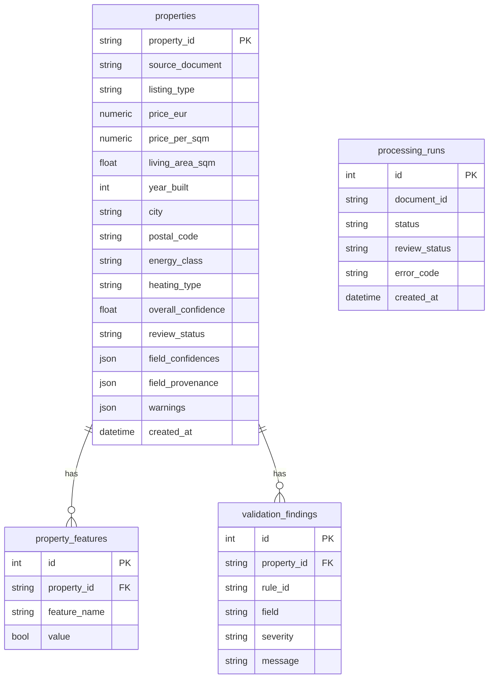

# Data Model & Schema Design

## Design principles

1. **One source of truth.** Every extractable field is declared once in the
   **field registry** (`schemas/fields.py`) with its data kind, its location in
   the record, whether it is mandatory, and its enum (if any). Extraction,
   normalisation, validation, scoring, storage, evaluation, and the UI all read
   from this registry, so the field set cannot drift between layers.
2. **Permissive schema, strict validation.** The record schema does not reject
   implausible values; it stores them and lets the validation layer flag them.
   Failures are routed to humans, never silently dropped (type correctness is
   guaranteed by normalisation upstream).
3. **Quality travels with data.** Confidence, provenance, validation findings, and
   the routing decision are attached to every record via a `QualityReport`.
4. **Tri-state booleans.** Equipment features are `True` / `False` / `None`
   (not stated). The pipeline never asserts a fact the document didn't make, and
   the `False` state is actually populated: the deterministic extractor detects
   German negation ("kein Balkon", "ohne Keller") and records an explicit absence,
   distinct from a feature the document simply never mentions.

## Target schema (`PropertyRecord`)

The canonical Silver artifact (Pydantic v2). Abridged:

```text
PropertyRecord
├── schema_version, property_id (= Bronze document id), source_document, extracted_at
├── title, listing_type, price_eur (Decimal), price_kind, price_per_sqm (derived)
├── living_area_sqm, plot_area_sqm, rooms, floor, total_floors, year_built
├── condition, availability_date
├── location:  street, house_number, postal_code, city, district, country
├── features:  balcony, terrace, garden, parking, cellar, elevator,
│              fitted_kitchen, furnished, barrier_free   (each bool | None)
├── energy:    energy_class (A+…H), heating_type, energy_demand_kwh, certificate_type
└── quality:   overall_confidence, completeness, validation_pass_rate,
               review_status, field_confidences{}, field_provenance{},
               findings[], warnings[]
```

`price_per_sqm` is a **computed field** (`price_eur / living_area_sqm`), not stored
input, derived enrichment for analytics.

## Relational schema (Silver, SQLite via SQLAlchemy)

Normalised so sparse/repeating data does not bloat the main row:



### Rationale for the table split

- **`properties`**: one row per record holds the scalar attributes and the
  quality summary. Per-field confidence/provenance live in **JSON columns**: they
  are always read together with the record and never queried relationally, so a
  child table would add joins without analytical value.
- **`property_features`**: features are sparse and set-like; a long table keeps
  the main row clean and makes "all listings with a balcony" a trivial filter.
- **`validation_findings`**: a record can have many findings; a child table keeps
  them queryable for data-quality dashboards.
- **`processing_runs`**: an append-only audit of *every* execution, including
  failures (with error code), independent of whether a record was produced. This
  is the operational backbone for monitoring and SLAs.

## Gold model (DuckDB / Parquet)

- **`properties`**: a wide, analytics-friendly flattening (one row per listing,
  enums as strings, money as doubles) exported to Parquet + CSV.
- **`features`**: a long `(property_id, feature_name, value)` table.
- **`market_summary`**: city-level aggregates for sale listings (count, avg
  price/m², avg area, avg confidence).

## Portability

Because persistence goes through SQLAlchemy and a repository, the same models map
onto **Azure SQL** or **PostgreSQL** by changing the connection string; the Gold
DuckDB/Parquet layer maps onto a **Microsoft Fabric** Lakehouse/Warehouse.
